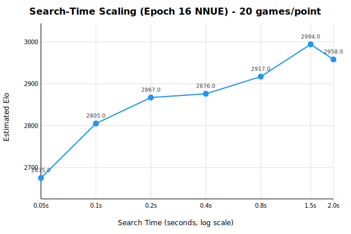
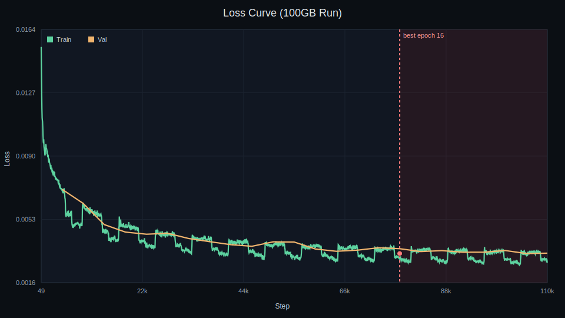

# Chess Engine

Speed Demon NNUE training pipeline focused on Stockfish‑compatible networks
(HalfKAv2_hm, 2560/15/32, int8). This repo is intentionally scoped to the
current NNUE approach only.

## Quick Start

RunPod (recommended):

```bash
git clone https://github.com/MalyisGreat/chessengine.git
cd chessengine
python speed_demon/runpod_train.py --stockfish-compat
```

Local (Windows):

```powershell
python -m pip install -r requirements.txt
python speed_demon\runpod_train.py --stockfish-compat
```

For full, reproducible commands (100 GB 2023–2024 run and epoch‑16 stop), see:
`docs/QUICKSTART.md`.

## Outputs

- Checkpoints: `outputs/speed_demon/lightning_logs/version_*/checkpoints/*.ckpt`
- NNUE nets: `outputs/speed_demon/nnue/*.nnue`
- Eval logs: `outputs/speed_demon/eval/`

## Results and Graphs

Full results and plots live in `docs/RESULTS.md`.




## Helpers

- Aggregate eval logs: `python scripts/aggregate_eval.py --eval-dir outputs/speed_demon/eval --out outputs/speed_demon/eval/combined_eval.jsonl`
- Plot scaling results: `python scripts/plot_scaling.py --csv docs/scaling_run_20260105_220739.csv --out docs/scaling_run_20260105_220739.svg`

---

## Experimental: Lc0 Data Training

Alternative training pipeline using Lc0 evaluation data instead of self-play.
**Separate** from main speed_demon training.

**Motivation:** Main training plateaus around 2900-3000 Elo. Lc0's test80 rescored
positions (~800M positions) may provide higher-quality evaluations.

```bash
# Train from scratch on Lc0 data (auto-downloads ~7GB, builds data loader)
python scripts/cloud_finetune_lc0.py --force-fresh --epochs 15 --batch-size 32768
```

The script automatically:
- Clones nnue-pytorch if needed
- Builds C++ data loader with BMI2 support (critical for speed)
- Downloads and decompresses Lc0 test80-2024-02-feb data
- Trains and exports final NNUE to `models/nn-finetuned-lc0.nnue`

**Note:** First epoch shows 0% for ~15 min while torch.compile JIT-compiles kernels.
