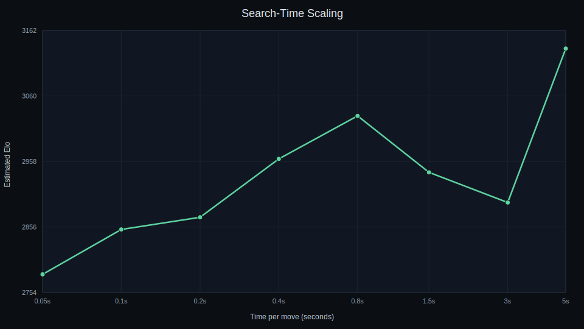

# Results Summary (Jan 2026)

## Dataset

- Sources: `test80_2023_2024_minv2_v6.txt`
- Shards: June 2023 through June 2024 (min-v2 v6)
- Cap: 100 GB

## Model

- Feature set: HalfKAv2_hm (Stockfish 16.1 compatible)
- Layers: 2560 / 15 / 32
- Quantization: int8

## Training Configuration (best run)

- Positions per epoch: 100,000,000
- Total positions: ~3.3B
- Batch size: 32,768
- Eval: Stockfish ladder (0.1s per move)
- Strongest snapshot: epoch 16 (~1.6B positions)

## Head-to-Head Findings

- Epoch 16 vs epoch 23 (10 games, 0.1s, threads 6):
  - Epoch 16 won 9/1/0

## Stockfish 3000 Results (10 games, 0.1s)

| Epoch | W/D/L | Score | Est Elo |
|------:|:-----:|------:|--------:|
| 16 | 0/6/4 | 0.300 | 2852.8 |
| 17 | 1/3/6 | 0.250 | 2809.2 |
| 18 | 0/4/6 | 0.200 | 2759.2 |
| 19 | 0/5/5 | 0.250 | 2809.2 |
| 23 | 1/7/2 | 0.450 | 2965.1 |

## Search-Time Scaling (Epoch 16 NNUE)

Run: 2026-01-05 (Stockfish 16.1, base Elos 2600–3190, 5 games/point, threads 4, workers 12).

Data: `docs/scaling_run_20260105_041456.csv`

## Loss Curve (Recent Run)

Data: `docs/loss_curve_latest.csv`

Notes:
- Dashed line marks the best validation loss.
- Red shading shows the post-best region (overfit zone) for this architecture.

## Notes

- Small samples are noisy. Prefer 20+ games for stable estimates.
- Stockfish rejects incompatible NNUE files. Use `--stockfish-compat` or re-serialize with `--ft_compression leb128`.
- Aggregated eval logs can be written to `outputs/speed_demon/eval/combined_eval.jsonl`.
